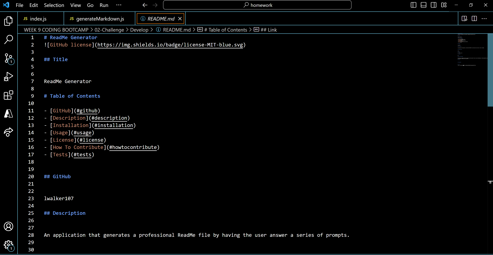

# Landen AutoReadMe Generator

## Title

Landen AutoReadMe Generator

# Table of Contents

- [GitHub](#github)
- [Description](#description)
- [Installation](#installation)
- [Usage](#usage)
- [License](#license)
- [How To Contribute](#howtocontribute)
- [Tests](#tests)
- [Screenshot](#screenshot)
- [Link](#link)

## GitHub

[Link](https://www.github.com/lwalker107)

## Email

landenwalker880@gmail.com

## Description

Has the user answer a series of prompts and uses the answers to create a professional readme file for them.

## Installlation 

npm i

## Usage

You need node.js installed into your computer env for it to work.

## License

MIT

## How to Contribute

You need to know my GitHub username, my email for questions and a working knowledge of Git.

## Tests

npm run tests

## Screenshot

## Link 

https://drive.google.com/file/d/1agRqeA_8mZOBwnuRCczkzg6gss4eL0fR/view